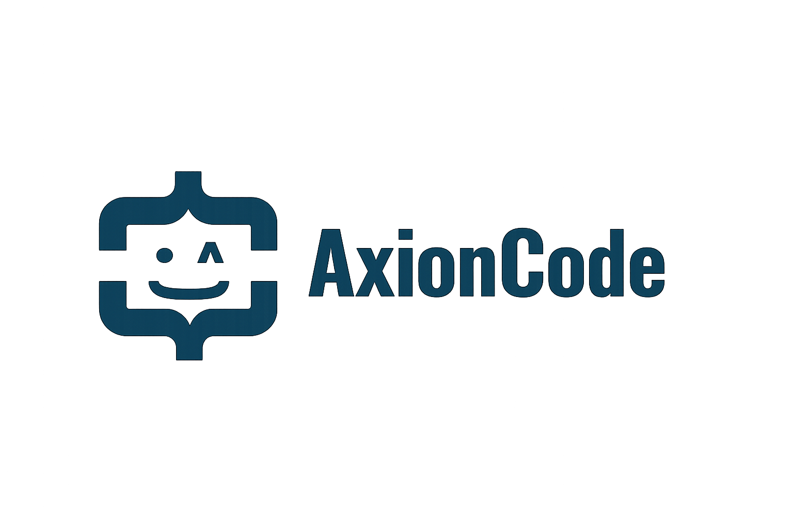

  <a href="#english">🇺🇸 English</a> | 
  <a href="#espanol">🇪🇸 Español</a>

  <picture>
    <source media="(prefers-color-scheme: dark)" srcset="logo-dark.png">
    <source media="(prefers-color-scheme: light)" srcset="logo-light.png">
    
  </picture>

---

## 🇺🇸 AxionCode — Web Development Studio

We are a small team of developers focused on building clean, high-performance web experiences. We combine solid code with modern tools to deliver reliable digital solutions.

### 💡 Have an idea in mind? We make it a reality.
Our core focus is custom Web Development. We handle the technical side so you can focus on growing your project, ensuring your site is fast, modern, and works perfectly on any device.

* **Landing Pages & Web Sites:** Tailored digital presentations designed to showcase your project or business.
* **E-Commerce & Platforms:** Custom web solutions built to fit your specific needs.

### 💻 Our Tech Stack
We build our projects using modern and optimized technologies:

  
  
  
  
  
  
  
  

### 📬 Get in Touch
* **Email:** axioncode.dev@gmail.com
* **Website:**  (Coming Soon)

---

## 🇪🇸 AxionCode — Estudio de Desarrollo Web

Somos un pequeño grupo de desarrolladores enfocados en crear experiencias web limpias y de alto rendimiento. Combinamos código sólido con herramientas modernas para entregar soluciones digitales confiables.

### 💡 ¿Tienes una idea en mente? La hacemos realidad.
Nuestro enfoque principal es el Desarrollo Web personalizado. Nos encargamos de la parte técnica para que puedas concentrarte en hacer crecer tu proyecto, garantizando que tu sitio sea rápido, moderno y funcione perfectamente en cualquier dispositivo.

* **Landing Pages y Sitios Web:** Presentaciones digitales a medida diseñadas para dar a conocer tu proyecto o negocio.
* **E-Commerce y Plataformas:** Soluciones web personalizadas construidas según tus necesidades específicas.

### 💻 Stack Técnico
Construimos nuestros proyectos utilizando tecnologías modernas y optimizadas:

  
  
  
  
  
  
  
  

### 📬 Contacto
* **Correo Electrónico:** axioncode.dev@gmail.com
* **Sitio Web:** (Próximamente)
